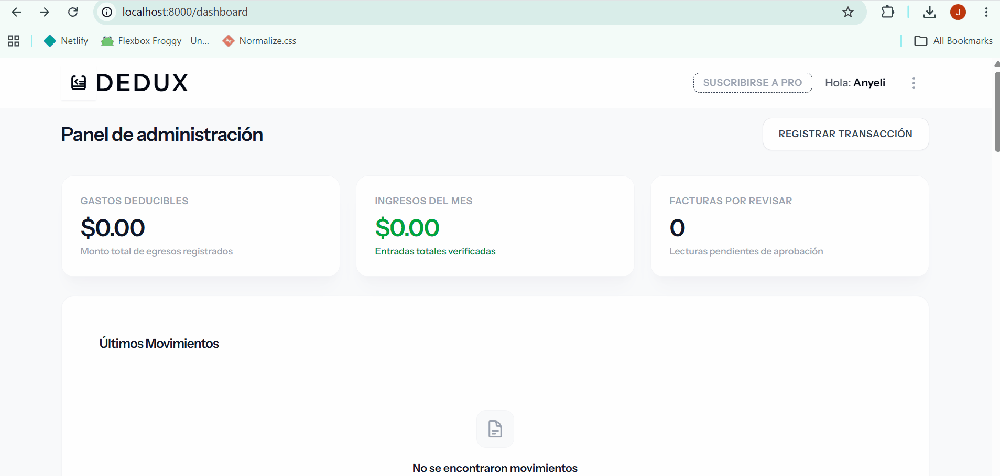
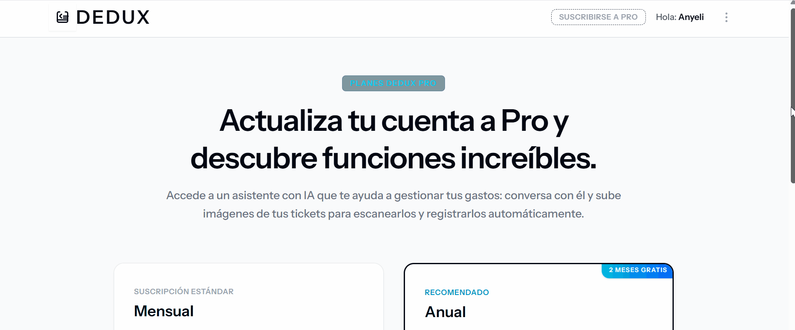

# Dedux | Sistema de Pre-Contabilidad e Inversión Basado en IA

**Dedux** es una aplicación web moderna diseñada para automatizar y simplificar la gestión de ingresos, facturas y pre-contabilidad utilizando Inteligencia Artificial. Diseñada bajo un enfoque minimalista, elegante y de alto rendimiento.

---

## 🚀 Acceso Rápido (Demo)

¡Prueba la aplicación al instante sin necesidad de registrarte!

* **URL del proyecto:** [Visitar Dedux en Vivo](https://dedux-system.onrender.com/)

* **Instrucciones:** En la pantalla de inicio de sesión, haz clic en el botón **Ingresar como Usuario Demo** para acceder al Dashboard con un solo clic con datos de prueba ya cargados.

---

## 🛠️ Stack Tecnológico

El proyecto utiliza un stack moderno y fuertemente tipado para garantizar la escalabilidad y mantenibilidad:

* **Backend:** Laravel 13 / 13 (PHP)

* **Frontend:** React + TypeScript

* **Monolito Híbrido:** Inertia.js (React Server-Driven)

* **Estilos:** Tailwind CSS (Con soporte completo para Modo Claro / Oscuro)

* **Base de Datos:** PostgreSQL

* **Despliegue & Infraestructura:** Docker + Railway

---

## 📐 Arquitectura del Software

**Dedux** está desarrollado utilizando el patrón arquitectónico **MVC (Modelo-Vista-Controlador)** optimizado de Laravel, integrado con un enfoque moderno de desarrollo frontend:

*   **Modelos (Backend):** Gestión de la lógica de negocio, relaciones de base de datos (PostgreSQL) y políticas de seguridad mediante Eloquent ORM.

*   **Controladores (Backend):** Orquestación de las peticiones HTTP, manejo de la lógica de pre-contabilidad, conexiones con servicios externos de IA y retorno de respuestas de datos hacia el cliente.

*   **Vistas (Frontend con React):** En lugar de usar plantillas Blade tradicionales, las vistas se renderizan en el cliente utilizando componentes dinámicos en **React y TypeScript**, lo que ofrece una experiencia de Single Page Application (SPA).

*   **Inertia.js:** Funciona como el puente de comunicación directo entre los Controladores y las Vistas de React, eliminando la necesidad de construir y mantener una API REST compleja de forma separada.

---

## ✨ Características Principales

* **Autenticación Segura:** Manejo de sesiones y control de accesos optimizado.

* **Registro Automatizado:** Carga y lectura inteligente de datos de facturación mediante IA.

* **Sistema de Suscripciones:** Gestión de planes de pago recurrentes implementada mediante Laravel Cashier, manteniendo suscripciones activas durante los procesos de actualización de plan (*swaps*).
  
* **Dashboard Analítico:** Gráficos limpios y reportes financieros en tiempo real.

* **Interfaz Minimalista:** Diseño elegante en una paleta monocromática (Black & White) con transiciones suaves y soporte nativo para `Dark Mode`.

---

## 💻 Instalación Local

Si deseas clonar el repositorio y ejecutarlo en tu entorno local, sigue estos pasos:

1. **Clonar el repositorio:**

   ```bash

   git clone [[https://github.com/anyeli5229/dedux.git](https://github.com/anyeli5229/dedux.git)](https://github.com/anyeli5229/Dedux-System)

   cd dedux

2. **Instalar dependencias del Backend (PHP/Laravel):**

   ```bash

   composer install

3. **Instalar dependencias del Frontend (React/TypeScript):**

   ```bash

   npm install
   
4. **Configurar las variables de entorno:**
   Copia el archivo de ejemplo y asegúrate de configurar las credenciales de tu base de datos local y las llaves de pasarela de pago para las suscripciones:

   ```bash

    cp .env.example .env

5. **Generar la clave de la aplicación y limpiar cachés:**

   ```bash

    php artisan key:generate

    php artisan config:clear
   

6. **Ejecutar migraciones y seeders:**

Este comando creará las tablas necesarias en PostgreSQL y cargará los datos iniciales (incluyendo las credenciales del usuario demo):
    
    php artisan migrate --seed
    

7. **Iniciar los servidores de desarrollo:**

Para levantar el servidor backend de Laravel e iniciar el compilador de assets para React:

   ```bash
    php artisan serve
    npm run dev
   ```
Abre tu navegador en http://localhost:8000

---

## 📄 Licencia

Este proyecto es de código abierto bajo la licencia MIT.

---

### 🎬 Demostración del Sistema

<table width="100%">
  <tr>
    <td width="50%" valign="top">
      <h4>1. Registro y Validaciones</h4>
      
    </td>
    <td width="50%" valign="top">
      <h4>2. Protección de Rutas</h4>
      
    </td>
  </tr>
  <tr>
    <td colspan="2" align="center" valign="top">
      <h4>3. Pasarela de Pagos (Stripe Cashier)</h4>
      
    </td>
  </tr>
</table>
